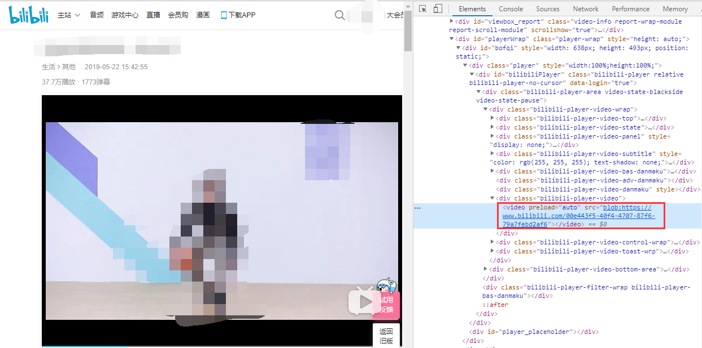

自从HTML5提供了video标签，在网页中播放视频已经变成一个非常简单的事，只要一个video标签，src属性设置为视频的地址就完事了。但以为这里暴露了真实的视频网络地址，所以在早期一般网站的资源文件不怎么通过referer设置防盗链，所以当我们拿到视频的地址后可以随意的下载或使用（当年每次放假回家，就会有亲戚找我让我帮她们从一些视频网站上下东西）。   

> Tips：目前的云存储服务商大部分都支持referer防盗链。其原理就是在访问资源时，请求头会带上发起请求的页面地址，判断其不存在（表示直接访问图片地址）或不在白名单内，即为盗链。

可是从某个时间开始我们打开调试工具去看各大视频网站的src会发现，它们统统变成了这样的形式。



拿b站的一个视频来看，红框中的视频地址，这个blob是个什么东西？尝试直接下载一下毫不意外的下载失败了。

其实这个video blob也不是什么新技术，国内外出来都有一阵子了，但是网上的相关的文章不多，今天就和大家一起分享学习一下，说不定哪天项目就能用上。

## Blob和ArrayBuffer

我们都知道计算机中的数据是用二进制的方式存储的，所以我们的图片，音视频等，也可以直接以二进制的形式存储，早期数据库就常常用Blob来存储这些二进制数据对象。在web领域，Blob对象表示一个只读原始数据的类文件对象，虽然是二进制原始数据但是类似文件对象，因此可以像操作File对象一样操作Blob对象，实际上，File继承自Blob。

ArrayBuffer对象用来表示通用的、固定长度的原始二进制数据缓冲区（其实就是内存），它不能直接读写，只能通过视图（TypedArray视图和DataView视图)来读写，视图的作用是以指定格式解读二进制数据。Blob可以和ArrayBuffer互相转换。

类型数组对象有以下几个:

- Int8Array：8位有符号整数，长度1个字节。
- Uint8Array：8位无符号整数，长度1个字节。
- Uint8ClampedArray：8位无符号整数，长度1个字节，溢出处理不同。
- Int16Array：16位有符号整数，长度2个字节。
- Uint16Array：16位无符号整数，长度2个字节。
- Int32Array：32位有符号整数，长度4个字节。
- Uint32Array：32位无符号整数，长度4个字节。
- Float32Array：32位浮点数，长度4个字节。
- Float64Array：64位浮点数，长度8个字节。

创建Blob对象并转换成ArrayBuffer：

```javascript
//创建一个以二进制数据存储的html文件
const text = "<div>hello world</div>";
const blob = new Blob([text], { type: "text/html" }); // Blob {size: 22, type: "text/html"}
//以文本读取
const textReader = new FileReader();
textReader.readAsText(blob);
textReader.onload = function() {
  console.log(textReader.result); // <div>hello world</div>
};
//以ArrayBuffer形式读取
const bufReader = new FileReader();
bufReader.readAsArrayBuffer(blob);
bufReader.onload = function() {
  console.log(new Uint8Array(bufReader.result)); // Uint8Array(22) [60, 100, 105, 118, 62, 104, 101, 108, 108, 111, 32, 119, 111, 114, 108, 100, 60, 47, 100, 105, 118, 62]
};
```

创建一个相同数据的ArrayBuffer，并转换成Blob：

```javascript
//我们直接创建一个Uint8Array并填入上面的数据
const u8Buf = new Uint8Array([60, 100, 105, 118, 62, 104, 101, 108, 108, 111, 32, 119, 111, 114, 108, 100, 60, 47, 100, 105, 118, 62]);
const u8Blob = new Blob([u8Buf], { type: "text/html" }); // Blob {size: 22, type: "text/html"}
const textReader = new FileReader();

textReader.readAsArrayBuffer(u8Blob);
textReader.onload = function() {
  console.log(textReader.result); // 同样得到div>hello world</div>
};
```

更多Blob和ArrayBuffer的相关内容可以参看下面的资料：
- [MDN Blob](https://developer.mozilla.org/zh-CN/docs/Web/API/Blob)
- [MDN ArrayBuffer](https://developer.mozilla.org/zh-CN/docs/Web/JavaScript/Reference/Global_Objects/ArrayBuffer)
- [阮一峰js标准参考教程二进制数组](https://developer.mozilla.org/zh-CN/docs/Web/JavaScript/Reference/Global_Objects/ArrayBuffer)


## URL.createObjectURL()

video标签，audio标签还是img标签的src属性，不管是相对路径，绝对路径，或者一个网络地址，归根结底都是指向一个文件资源的地址。既然我们知道了Blob其实是一个可以当作文件用的二进制数据，那么只要我们可以生成一个指向Blob的地址，是不是就可以用在这些标签的src属性上，答案肯定是可以的，这里我们要用到的就是URL.createObjectURL()。

```javascript
const objectURL = URL.createObjectURL(object);
```

这里的object是用于创建URL的File对象、Blob 对象或者 MediaSource 对象，生成的链接就是以blob:开头的一段地址，表示指向的是一个Blob对象：

```shell
blob:http://localhost:1234/abcedfgh-1234-1234-1234-abcdefghijkl
```

上面地址中的localhost:1234是当前URL的主机名称和端口号，也就是location.host，而且这个blob地址是可以直接访问的。

>Tips: 值得注意的是如果是以文件协议打开的html文件（即url为file://开头），则地址中http://localhost:1234会变成null，而且此时这个blob地址是无法直接访问的。

## 实战：上传图片预览

有时我们通过input上传图片文件之前，会希望可以预览一下图片，这个时候就可以通过前面所学到的东西实现，而且非常简单。

html
```html
<input id="upload" type="file" />

```

javascript
```javascript
const upload = document.querySelector("#upload");
const preview = document.querySelector("#preview");

upload.onchange = function() {
  const file = fileBtn.files[0];
  const src = URL.createObjectURL(file);
  preview.src = src;
};
```

这样一个图片上传预览就实现了，是不是非常简单，同样的这个方法也适用于上传视频的预览。


