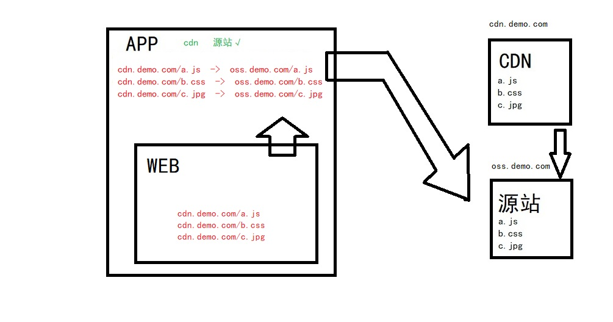
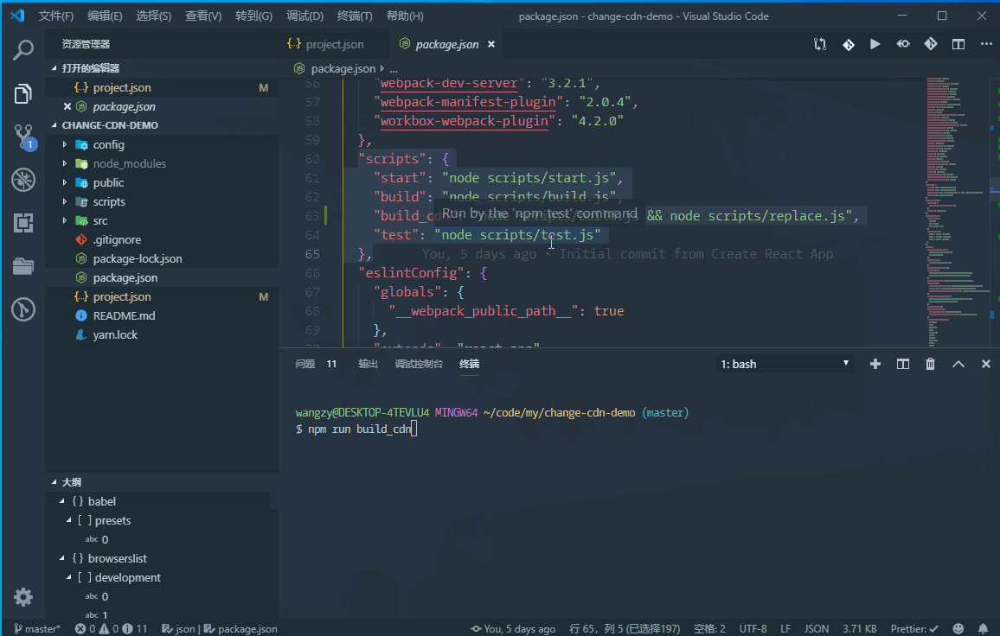
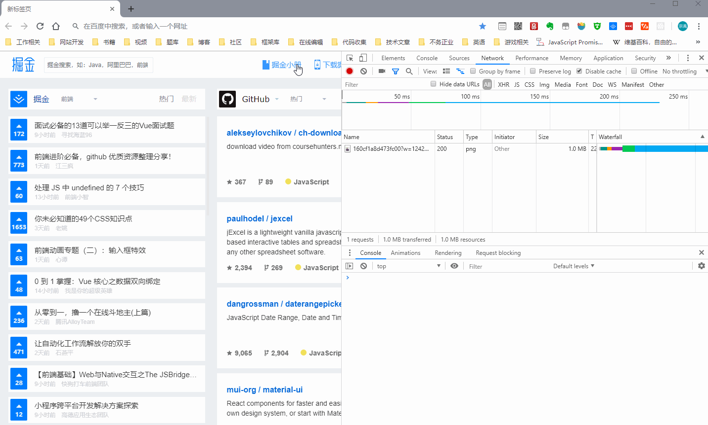

## 开篇词

今年开始厚着脸皮写一些技术文章，大概平均两周能写出一篇。产量不高，一是因为平时上班还是挺忙的，二是不想为了写而写，如果自己都不觉得有意思的东西，是很难写下去的。

俗话说的好评论装逼末尾要加后缀，文章牛逼标题要加前缀，所以一直也想写个什么系列，可以给文章标题加个前缀。但是像什么闭包，防抖等基础概念之类的，很多书籍和文档都写得都非常好，我觉得我也写不出什么新花样来。 

其实前端入行几年后感觉自己一个明显的变化是，从菜鸟的时候很多东西不会做，最常担心的是东西做不出来，到现在东西都能做出来，无非就是不同技术的选择组合，最常担心的是实现方式是不是最优的，业内普遍的做法又是什么。所以我更想写一个记录平时工作中解决某个问题或是实现某个功能的系列文章，给有类似功能开发需求的朋友提供个思路，同时也和大家一起分享交流看有没有更好的实现方案。

## 需求说明

为了提高用户访问体验，公司的APP及内嵌H5页面都使用了CDN加速，但是前几天出了一些问题，因为CDN服务商二级节点服务器宕机，导致部分区域的移动用户无法正常访问，由于只是CDN服务器的问题，其实源站地址还是可以访问的。后来又出了一次类似的事，上头就要求我们做一个CDN切换的功能，如果某些用户通过CDN访问出了问题，可以切换其他CDN或直接访问源站。    
对于我们前端来说，如果html文件和引入的静态资源放在一起，这事其实挺简单。但是问题在于我们html在一个服务器上，而静态资源在专门的OSS（Object Storage Service，对象存储服务）上，这就有点麻烦了。

## 相关知识介绍

### 什么是ＣＤＮ

>内容分发网络（英语：Content Delivery Network或Content Distribution Network，缩写：CDN）是指一种透过互联网互相连接的计算机网络系统，利用最靠近每位用户的服务器，更快、更可靠地将音乐、图片、影片、应用程序及其他文件发送给用户，来提供高性能、可扩展性及低成本的网络内容传递给用户。  

上面的文字内容来自维基百科，可能有些书面，简单来说是这样一个过程：  

你有一个文件a.js放在杭州的一台服务器上，然后你有了一个源站地址`hangzhou.oss.com/a.js`，如果你请求这个地址就是从源站拿到a.js文件，但是这个服务器江浙沪可能访问很快，但是在平顶山（我老家，河南一个市）访问就不那么快了，于是我花点钱配置了CDN加速，给了我一个CDN加速地址`cdn.oss.com/a.js`，当我在平顶山访问这个地址时，请求到离我最近的郑州的一台CDN服务器，发现这台服务器上是有这个`a.js`的，也没有过期（缓存命中），于是就可以直接返回。如果这个`a.js`过期或是不存在，则会规划出一条最优线路找到下一个存在`a.js`的CDN服务器或者直接回源站拿取并保存，下一次访问就可以直接返回资源。

CDN服务阿里，腾讯，华为大厂都有在做，还有一些比如网宿，又拍云，七牛等，境外cdn加速据说Akamai（阿卡迈）挺不错。我们公司用的是上面哪一个为了照顾一下他们面子，就不指名了，欢迎大家评论推荐更多优秀的CDN服务商。

### 资源引用路径

通常网页中资源的引用路径有两种，相对路径和绝对路径。

相对路径引入的文件是这样：

```html 
 <!-- html -->
 <!-- 相对路径以 ./或者直接路径名开头 -->
 <link href="./style.css" rel="stylesheet" /> 
```
相对路径相对的是当前页面的路径，假设这个html的访问地址是`www.demo.com`，路径就是根路径`/`，引入的css网络请求地址就是`www.demo.com/style.css`.如果这个html的访问地址是`www.demo.com/login`，路径就是`/login`，则css网络请求地址为`www.demo.com/login/style.css`。   
相对路径引入资源最后的网路请求可以看做`location.host + location.pathname + 文件路径` 。

绝对路径引入的文件是这样：

```html 
 <!-- html -->
 <!-- 绝对路径以一个/开头，可能有见过//www.demo.com/a.js这种的，这是表示引入资源协议（protocol）和当前页面一致 -->
 <link href="/style.css" rel="stylesheet" /> 
```
绝对路径引入的资源跟当前页面的路径无关，就是从根路径开始，不管你html的访问地址是`www.demo.com`还是`www.demo.com/login`，上面绝对路径引入的css样式文件的网络请求都是`www.demo.com/style.css`。  
相对路径引入资源最后的网路请求可以看做`location.host + 文件路径` 

通常不建议网页中使用相对路径引入资源，尤其是现在很多SPA应用前端控制路由改变路径，相对路径可能会造成很多混乱和麻烦。平时项目开发时可以用相对路径，然后用webpack这样的打包工具通过配置公共路径，打包时把相对路径替换掉。vue和react官方脚手架创建的项目，webpack默认的公共路径就是`/`，最后打包后的文件中所有的资源路径都是以`/`开头的绝对路径。

### 公共路径
webpack中publicPath就是用来配置公共路径的，公共路径是项目打包后资源的基础路径，也可以理解为前缀，通常情况下都是`/`，表示当前访问地址的绝对路径。但有的时候，我们会将js，css，图片等静态资源存放另一台服务器，这时就可以将公共路径设置为对应的域名。比如我们设置publicPath为`https://oss.demo.com`，那么像`style.css`的引用路径就会是`https://oss.demo.com/style.css`这样完整的网路地址。

现在想一下为什么前面说html文件和引入的静态资源放在一起切换CDN这事就简单。很明显，放在一起使用绝对路径，静态资源是跟着访问地址的。以`cdn.demo.com`访问到html，html中的资源请求就都是`cdn.demo.com`开头，你换`oss.demo.com`就是`oss.demo.com`，相当于自动切换，根本不用我们做什么。但是当我们静态资源和html在不同的服务器，引入路径已经写死了前缀地址，像上面的`https://oss.demo.com/style.css`，你不管是从任何地址访问到html，这个css的请求永远都是`https://oss.demo.com/style.css`。

```!
像create-react-app创建的项目，在未使用`npm run eject`弹出webpack配置文件之前，可以通过创建或修改package.json中的homepage字段来修改公共路径。
```

## 方案思路

### 1.APP代理请求

当时我首先想到的一个方案是APP代理请求，因为我们的页面是内嵌在APP里面的，页面的所有网络请求APP都能拦截的到，切换CDN后APP将拦截到的所有网页请求替换为切换后的CDN地址，大概示意图如下。

切换前：

切换后：


这个方案的好处是前端网页不用做任何修改，以后如果再添加其它的CDN，也只需要APP端多配置几个代理地址即可，客户端评估了可行性后决定去做。但是他们提出拦截处理网页的网络请求，可能对APP的性能造成影响，希望我们前端以后能自己实现这个切换。

```!
我在提出这个方案之前特意去查了一下，安卓，苹果和windows各端实现的难易程度是不等的，而且ios的WKWebView中拦截POST请求会导致body丢失，有解决方法但会有些麻烦。建议API调用地址切换前端自己控制是简单的，APP只负责资源加载的代理拦截。
```

### 2.前端多次构建

于是还要再想一个方案出来，也就是前端自己来切换，现在先来看一下我们的项目情况：

- React单页应用，通过webpack打包。
- 线上访问地址是https://www.demo.com
- 网页用到静态资源服务器地址为https://oss.demo.com
- 静态资源服务器CDN加速地址为https://cdn.demo.com
- 网页中所有的静态资源的公共路径在构建时已经设置为https://cdn.demo.com

一种简单粗暴的方式是我构建两次，一次公共路径设置为https://oss.demo.com，一次公共路径设置为https://cdn.demo.com，放在https://oss.demo.com不同路径下。两个html文件放在https://www.demo.com，通过监听不同端口或区分一下参数响应不同的html就可以了。

这种方法的好处是简单，不用对项目进行什么处理，缺点是整个项目要出两套，以后添加一个cdn线路就要多加一套，而且需要中间层的配合，所以这个方案被我排除掉。

### 3.动态切换公共路径

既然不想多次构建，那么要实现的就是，只有一个html，通过某种手段动态切换项目中的公共路径，公共路径改变就意味着访问资源请求的改变，从而达到CDN切换的目的。

首先说动态，这个最简单的方式就是通过URL传参，不同的参数对应不同的地址。比如我们设置一个cdn的参数，如果访问地址是`https://www.demo.com?cdn=1`时我们使用`https://cdn.demo.com`作为公共路径，`https://www.demo.com?cdn=0`时使用`https://oss.demo.com`作为公共路径。

比较难的是公共路径的切换，上面已经说了公共路径是webpack在构建打包时就已经通过配置写入项目的，即在打包时就已经确定了公共路径的，查看打包后的js代码会发现这样的代码。

```javascript
// __webpack_public_path__
__webpack_require__.p = "https://oss.demo.com";

(function(module, exports, __webpack_require__) {
    eval("module.exports = __webpack_require__.p + \"a.f58ad020.jpg\";\n\n//# sourceURL=webpack:///./a.jpg?");
 }),
```

我们可以看到公共路径赋值给了`__webpack_require__.p`，如果想要动态切换公共路径，意味着我们需要在后期修改`__webpack_require__.p`的值，webpack提供了一个特有变量`__webpack_public_path__`。

```！
webpack特有变量，就是webpack在打包我们代码时外面包裹了一层函数，一些变量通过参数传递进来让我们可以在代码中使用，即使这些变量在宿主环境（比如浏览器）里面是没有的（像require，import，export等）。
```

我们只需给__webpack_public_path__赋值就可以改变公共路径，建议放在入口文件的最顶部，如下：

```javascript
// publicConfig.js
__webpack_public_path__ = 'https://cdn.demo.com';

// 入口文件 index.js
import './publicConfig.js'   
import React from 'react';
import ReactDOM from 'react-dom';
```

这段代码打包后会有这样一段内容。

```javascript
(function(module, exports, __webpack_require__) {
    eval("__webpack_require__.p = \"https://cdn.demo.com\";\r\n\n\n//# sourceURL=webpack:///./src/publicConfig.js?");
}),
```
毫无疑问`__webpack_require__.p`被重新赋值了，虽然`__webpack_require__`是作为参数传入的，但是由于是引用类型，源对象上的`p`也发生了变化。

看似问题轻易得到了解决，但是这种修改只针对js文件中的公共路径，对html中的css和js文件地址不起作用，css样式文件中通过url()方式引入的图片也无效。

要说明的一点是，如果你并未像我们的项目一样将css样式文件单独分离出来，是css in js的形式，公共路径的动态修改css样式文件是生效的。

```!
如果是create-react-app创建的项目，修改__webpack_public_path__可能会不生效，需要通过删除publicPath配置项来解决（是不设置而不是设置为空），但是导致的原因还没有深入的去分析。
```

### 最终方案

单纯只通过修改webpack配置来一步到位解决我们所有问题怕是有些困难，我们可能要针对不同的文件进行不同操作。

1. js和css：两套，每套文件里面的公共路径是不同的。
2. html：一个html文件，但由于有两套js和css，所以在html中就要能动态加载不同的js和css文件。
3. 图片，音视频等资源：由于使用的都是相同的资源，一套。
  
由于webpack打包其实比较耗时（跟项目大小也有关系），所以希望只打包一次就完成上面所有步骤。

## 方案实现

第三条不用处理，正常打包就行，从第二条开始。


打包一次生成两套公共路径不同的js和css文件，我相信通过修改webpack配置，或者某个webpack的plugin可以实现这个功能，但是这里我决定使用最简单粗暴的方式，文本替换。

我们首先以`https://oss.demo.com`为公共路径打包出一份，然后复制js和css文件夹，对复制出的两个文件夹内所有的文件进行文本搜索和替换，将`https://oss.demo.com`替换为`https://cdn.demo.com`。

我们当然不能手动去做这些事，写一个node脚本，建议把CDN相关信息配置到一个专门的json文件，方便管理和以后增添删除，大概代码如下。

```json
{
  "cdnList": ["Cdn","Cdn2"],
  "cdnUrl": {
    "Default": "oss.demo.com",
    "Cdn": "cdn.demo.com",
    "Cdn2": "cdn2.demo.com",
  }
}
```

```javascript
// scripts/replace.js
const path = require("path");
const fs = require("fs-extra"); //fs增强版，用了复制文件夹
const replace = require("replace-in-file"); //替换文件中的文本
const { cdnList, cdnUrl } = require("../project.json");

//创建一个替换任务 oss.demo.com -> cdn.demo.com
const createReplaceOptions = (dir, cdn) => {
  return {
    files: `${path.resolve(__dirname, `../build/static/${dir}${cdn}/`)}/*.*`,
    from: new RegExp(`${cdnUrl.Default}`, "g"),
    to: cdnUrl[cdn]
  };
};

//创建一个拷贝任务
const createCopy = (dir, cdn) => {
  return fs
    //文件夹拷贝 
    .copy(
      path.resolve(__dirname, `../build/static/${dir}`),
      path.resolve(__dirname, `../build/static/${dir}${cdn}`)
    )
    //对拷贝后文件夹中所有文件进行文本替换
    .then(() => {
      const options = createReplaceOptions(dir, cdn);
      return replace(options)
        .then(results => {
          console.log("替换结果：", results);
        })
    });
};
//根据cdn列表创建对应拷贝替换任务
cdnList.forEach(item => {
  const jsCopy = createCopy("js", item);
  const cssCopy = createCopy("css", item);
  Promise.all([jsCopy, cssCopy])
    .then(() => console.log("处理完成!"))
    .catch(err => console.error("处理失败：",err));
});

```
在package.json里面，对build命令进行修改，在执行完webpack打包后，执行复制替换操作。
```json
{
  "scripts": {
    "build_cdn": "node scripts/build.js && node scripts/replace.js",
  }
}

```
```!
Tips：用&&连接两条命令，前面一条命令执行完才会执行下一条，&则是前一条后台执行同时并行执行后一条，所以使用时请留意命令执行顺序的影响。
```
我们看一下效果：



这一步解决了css中url()引入资源和js中直接通过网络地址引入资源的公共路径问题，接下来是动态引入对应的css和js文件，方法就是根据条件创建link标签和script标签，插入html中即可。

```javascript
// cdn.js
var query = parseQueryString(window.location.href); //格式化url参数这里就不写详细代码了
var cdn = query.cdn; 
var cdnList = {
  Default: "https://oss.demo.com/",
  Cdn: "https://cdn.demo.com/",
  Cdn2: "https://cdn2.demo.com/"
};
//将判断后的公共路径存储在window上，后面有用。
if (cdnList[cdn]) {
  window.publicPath = cdnList[cdn];
} else {
  cdn = "";
  window.publicPath = cdnList.Default;
}
//动态加载css和js
function asyncAppendNode(tagName, fileName) {
  //css，js文件地址
  function createUrl(type) {
    return window.publicPath + "static/" + type + cdn + "/" + fileName;
  }
  var node = document.createElement(tagName);
  if (tagName === "link") {
    node.type = "text/css";
    node.rel = "stylesheet";
    node.href = createUrl("css");
    document.head.appendChild(node);
  } else {
    node.src = createUrl("js");
    document.body.appendChild(node);
  }
}

```
我们在html的head中引入这cdn.js文件（或直接写在html中也可以），确保其在网页加载后优先执行。但这种引入方式会导致这个文件不走webpack打包，没有babel编译，所有为了兼容更多浏览器建议不要使用太新的js特性。 

接下来我们来想一下原本webpack打包后js和css的引入方式，首先webpack打包会将css和js处理，生成文件名中带有hash值（为了控制版本）的打包后文件，然后通过html-webpack-plugin这个插件将打包后的文件引入到html中。

比如有两个文件，a.css和b.js，打包后插入html会变成这样。

```html
<head>
  <!-- 这个文件是直接在html中添加的所以webpack没有打包 -->
  <script src="/cdn.js"></script>
  <link href="https://oss.demo.com/a.388e587e.css" rel="stylesheet">
</head>
<body>
  <script src="https://oss.demo.com/b.6b602746.js"></script>
</body>
```

而我们希望生成后的html是下面这个样子，我们当然可以打包后手动修改，但是最好还是打包后直接就是我们想要的这种形式。

```html
<head>
  <script src="/cdn.js"></script>
  <script>
      asyncAppendNode("link","a.388e587e.css");
  </script>
</head>
<body>
   <script>
      asyncAppendNode("script","b.6b602746.js");
  </script>
</body>
```
由于我们已经在cdn.js写好了动态加载的方法asyncAppendNode，这里直接调用，传入必要参数就可以了。

现在剩下最后一个问题，怎么从原来的css，js文件引入方式改为函数调用，不用想只能通过html-webpack-plugin来做文章，但是只是通过配置是满足不了我们需求的，好在html-webpack-plugin为我们提供了插件扩展，我们可以为html-webpack-plugin来编写咱们自己的自定义插件，来实现需要的功能。

```javascript
const HtmlWebpackPlugin = require('html-webpack-plugin');

class DynamicLoadHtmlWebpackPlugin {
    constructor(options = {}) {
        // 配置插件用到的参数，callbackName就是动态加载函数的函数名
        // cdnVariableName就我们上面讲过的公共路径存储的变量名，我们cdn.js中是存到了window.publicPath上。
        const { callbackName = 'callback', cdnVariableName } = options;
        this.callbackName = callbackName;
        this.cdnVariableName = cdnVariableName;
    }
    // 重写html-webpack-plugin的生成数据
    rewriteData(node, data, fnName, publicPath) {
        //将插入css引用，改为插入函数调用的script。
        if (node === 'script') {
            const fileNames = data.map((item) =>
                item.attributes.href.split('/').pop(),
            );
            const styleHtml = fileNames
                .map((item) => `${fnName}('${node}','${item}');`)
                .join('');
            return [
                { tagName: 'script', voidTag: false, innerHTML: styleHtml },
            ];
        } else {
            //js插入有两类，一类是js文件引用，我们改为插入函数调用的script。还有一类是内联script代码，我们不用改为插入函数调用的形式。但是create-react-app创建的项目，环境变量赋值__webpack_require__.p = xxx是写在这里的，我们就处理一下，将公共路径替换为我们传入的变量名。
            const inlineScript = [];
            const srcScript = [];
            data.forEach((item) => {
                if (item.innerHTML) {
                    if (
                        typeof publicPath === 'string' &&
                        this.cdnVariableName
                    ) {
                        const html = item.innerHTML;
                        const newHtml = html.replace(
                            `="${publicPath}"`,
                            `=${this.cdnVariableName}`,
                        );
                        item.innerHTML = newHtml;
                    }
                    inlineScript.push(item);
                } else {
                    srcScript.push(item.attributes.src.split('/').pop());
                }
            });
            const scriptHtml = srcScript
                .map((item) => `${fnName}('${node}','${item}');`)
                .join('');
            return [
                ...inlineScript,
                { tagName: 'script', closeTag: true, innerHTML: scriptHtml },
            ];
        }
    }
    // HtmlWebpackPlugin在打包过程中，不同生命周期的回调，详细可以参考官方文档，不同的生命周期，数据的内容不同。
    apply(compiler) {
        compiler.hooks.compilation.tap(
            'DynamicLoadHtmlWebpackPlugin',
            (compilation) => {
                HtmlWebpackPlugin.getHooks(
                    compilation,
                ).beforeAssetTagGeneration.tapAsync(
                    (data, cb) => {
                        //在这个生命周期中可以拿到webpack配置的publicPath，保存一下。
                        this.publicPath = data.assets.publicPath;
                        cb(null, data);
                    },
                );
                HtmlWebpackPlugin.getHooks(
                    compilation,
                ).afterTemplateExecution.tapAsync(
                    (data, cb) => {
                        //在这个生命周期中，js和css的文件名已经确认，要插入标签的相关信息都放在一个数组对象中，很好处理，我们对其进行重写。
                        const newStyleData = this.rewriteData(
                            'link',
                            data.headTags,
                            this.callbackName,
                        );
                        data.headTags = newStyleData;
                        const newScriptData = this.rewriteData(
                            'script',
                            data.bodyTags,
                            this.callbackName,
                            this.publicPath,
                        );
                        data.bodyTags = newScriptData;
                        cb(null, data);
                    },
                );
            },
        );
    }
}

module.exports = DynamicLoadHtmlWebpackPlugin;

```

插件写完，在webpack.config.js中引入使用就可以了。

```javascript
const HtmlWebpackPlugin = require("html-webpack-plugin");
const DynamicLoadHtmlWebpackPlugin = require("./dynamicLoadHtmlWebpackPlugin");
module.exports = {
  ...
  plugins:[
    new HtmlWebpackPlugin(),
    new DynamicLoadHtmlWebpackPlugin({
          callbackName: "asyncAppendNode",
          cdnVariableName: "window.publicPath"
    }),
  ]
  ...
}

```

然后看一下打包后的html。


至此我们动态切换项目公共路径的功能已经开发完毕，我们通过url参数的改变，可以控制整个项目中资源的网络前缀，最后我们模拟看一下实际情况，网站地址是localhost:3000，CDN地址分别是localhost:3001和localhost:3002，让3001地址挂掉。




## 最后

再次强调一下，这不是一个完整的教程并推荐大家这样去做，而只是提出一个思路，里面用到的一些解决方式大家可以参考，但组合起来不保证是最优的方案，本文甚至本系列文章的目的更多的是希望引发大家思考和讨论交流。纸上得来终觉浅，绝知此事要躬行，工作实践才是检验技术的最佳途径，希望这篇文章能够大家带来帮助。