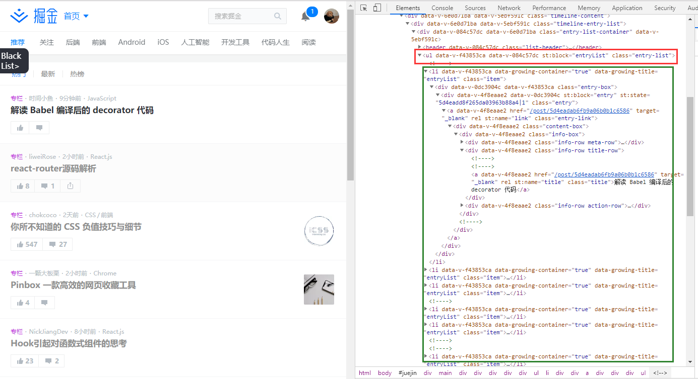
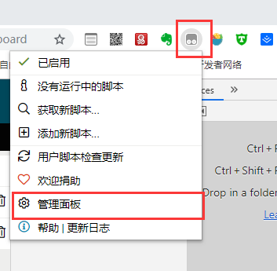
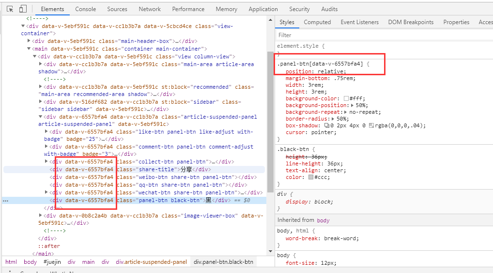

前几天掘金那篇什么挑战前端的文章很火（官方已经删除），但是几十的赞几百的评论，说明这篇文章不是火在质量而是火在争议。客观的来讲里面那道题是不错的，能帮助我们理解js的一些机制。作者关于多学习底层原理的观点我是认可的，但是学这些东西是让我们变牛B而不是去装B。      

还作者提到前端版块文章质量的问题我能理解，但不止前端版块其他版块也一样，任何社区的都不可能保证所有的文章都是精品，每个读者水平也不一样，你觉得这篇讲的东西没什么用，但是对于别人可能就很有帮助。

所以就如同评论下面很多人在说希望掘金出一个拉黑屏蔽功能，可以拉黑作者，屏蔽文章。这个功能确实可以满足很多人的筛选文章需求，但是催这个功能也不是一天两天，官方可能有自己的计划一直没有提上日程，我之前其实没这个需求，顶多就是不太想看面试类的文章，但是那篇文章出来之后，我发现我还是有拉黑需求的。相信官方日后肯定会出，但是远水解不了近渴，不如当下先自己开发一个插件来实现这个功能。

## 需求说明

1. 将不喜欢的作者拉入黑名单，在首页和搜索文章时不再显示黑名单中作者的文章。   
2. 讲不喜欢的关键字加入标题黑名单，在首页和搜索文章时不再显示标题中包含关键字的文章。
3. 在文章详情页面可以随时拉黑作者。
4. 可以对黑名单列表进行管理。

## 成品展示

> 特此说明，作者拉黑只是为了展示功能，而且为了效果特意选择了专栏比较多的高等级作者，对两位别CUE到的作者并无冒犯之意。

作者屏蔽


标题关键字屏蔽


## 方案思路

这次的实现思路其实非常简单，首先掘金的文章列表是后台请求回的数据，将来官方实现这个功能的时候可以后端直接返回过滤后的结果，也可以前端拿到数据时进行过滤处理再展示。而对于我们外部插件来说没有这个能力，只能通过将已经生成好的页面元素进行隐藏来达到我们的目的，我们先来一个最简单的。


### 控制台输入代码版

首先我们可以打开chrome的调试面板，看一下掘进首页文章列表的html结构：



如图所示所有的文章以`li`标签的形式，放在`class`为`entry-list`的`ul`中，那么我们现在要做的就是选中`entry-list`下的所有`li`标签并查找里面的内容，如果存在`css`关键字就隐藏掉这个`li`标签。

```javascript
//$$是大部分浏览器调试控制台都支持的API，等价于document.querySelectorAll，平时开发可不能用。
$$('.entry-list>li').forEach(item => {
    //innerText是一个节点及其后代的“渲染”文本内容，判断里面是否包含css，不区分大小写。
    if (/css/i.test(item.innerText)) {
        //符合要求的元素隐藏
        item.hidden = true;
    }
});
```
在控制台输入这段代码，你就会发现文章列表里面的包含css关键字的条目（这个不光是标题）都被隐藏掉了。

但是滚动条下滑后加载的文章还是会显示的，如果想隐藏只能在控制台再运行一遍这个代码。

### 油猴脚本版

我们要做的是一个完整的插件，而不能像上面那样人工手动在控制台输入代码，虽然你写一个完整的插件代码控制台跑也是可以，功能效果其实是一样的，但终究不是长远之计。

首先我们可以把这个功能做成一个浏览器插件，比如根据Chrome的规范和API建立项目开发，最后打包成crx格式的文件，浏览器就可以本地安装这个插件，或者花点钱成为谷歌开发者发布到谷歌应用商店。

浏览器插件的好处是，可以调用更多浏览器级的API，使用浏览器为原生插件提供的相关功能，但是对于我们只针对一个网站提供的小功能来说，有些杀鸡用牛刀了，而且这个插件也只有Chrome能用，如果其他浏览器想用还要再开发打包，比如FireFox就使用的是xpi格式的扩展。

一种更好的方式就是使用[Tampermonkey](http://www.tampermonkey.net/)。

Tampermonkey（国内习惯称其为油猴）是一个浏览器插件，是最为流行的用户脚本管理器，而且在 Chrome, Microsoft Edge, Safari, Opera Next, 和 Firefox都有对应的版本，也就是说我们写的脚本可以通过它跑在各个浏览器上。而我们今天就是通过油猴脚本的形式实现我们的功能。

对浏览器插件开发更感兴趣的朋友推荐这篇文章：[【干货】Chrome插件(扩展)开发全攻略](https://www.cnblogs.com/liuxianan/p/chrome-plugin-develop.html#%E6%89%93%E5%8C%85%E4%B8%8E%E5%8F%91%E5%B8%83)

## 方案实现

### 安装Tampermonkey

Tampermonkey的安装说简单也简单，说不简单也不简单，简单的是Tampermonkey被收录在各个浏览器的官方插件市场，很轻易的就可以搜索下载，而且不仅限于前面提到的那些浏览器，一些移动端浏览器也是支持的，还有虽然Tampermonkey官网没写，但是一些国产浏览器插件市场也是有的，比如360极速浏览器。不简单的原因嘛，就是有些浏览器的插件市场咱们不好访问。

如果浏览器插件市场实在没有，国产浏览器通常用了chromium内核的，也支持crx手动安装。

安装完成后我们可以在浏览器上点击油猴插件图标，可以在管理面板中查看，开启，删除，管理我们的脚本，可以在获取新脚本中找到几个脚本市场的网站，可以直接下载别人写好的脚本。




### 创建脚本文件

我们要自己开发脚本的话，选择添加新的脚本就可以打开一个脚本编写页面，但是建议还是在自己编辑器里写，有提示和格式化更方便。

创建后的脚本默认有一些代码如下(头部那些不是简单注释)，这里要用到的简单说明一下，更多内容可以参考[官方文档](https://www.tampermonkey.net/documentation.php?ext=dhdg)。

```javascript
// ==UserScript==
// @name         掘金文章黑名单                                 <-插件名，会显示在管理面板里
// @namespace    https://github.com/hoc2019/blackList          <-脚本命名空间
// @version      0.1                                           <-版本号
// @description  掘金文章黑名单过滤脚本                          <-描述
// @author       wangzy                                        <-作者
// @match        https://juejin.im/*                           <-只有匹配到的网站才会使用该脚本
// @require      https://cdn.bootcss.com/jquery/3.4.1/jquery.min.js   <-引入脚本，这里用了jQuery
// @grant        GM_addStyle                                   <-给网站添加css样式的方法
// ==/UserScript==

(function() {
    'use strict';

    // Your code here...
})();
```

### 文章列表过滤

文章列表的过滤隐藏和上面控制台输入代码版原理差不多，重点是触发隐藏操作的时机。由于数据异步请求，过早的话文章列表dom节点还没有被创建，过滤操作就会失败，而过晚的话就会肉眼可见列表的消失。

一个简单粗暴的方式就是写一个轮询，不断的去检测文章列表dom节点是否存在，存在则表示文章加载完成，可以进行过滤操作了。同理滚动到底部加载文章，也可通过轮询检测文章列表dom节点数量是否改变来触发过滤操作（当然也可以检测滚轮事件）。但是轮询本身就是一个在性能和体验上找平衡的方法，轮询间隔短了判断就准确，体验就好，但是会消耗很多性能，反之则性能好，体验差。

所以这里我们使用其他方法，MutationObserver来监听DOM数的改变，是旧的Mutation Events功能的替代品，详细内容可以参考MDN的[文档](https://developer.mozilla.org/zh-CN/docs/Web/API/MutationObserver)。

大概的使用方式如下：

```javascript
const container = $('#juejin');
const config = {
    attributes: false,      // 检测节点属性变化，这里用不到，为减少不必要的触发这里不用开启
    childList: true,        // 检测子节点添加和删除
    subtree: true           // 检测包含后代节点
};
const mutationCallback = mutationsList => {
    for (let mutation of mutationsList) {
        const type = mutation.type;
        const addedNodes = mutation.addedNodes;  //增加节点数组
        // 会根据上面的的设置触发相应事件，这里可以判断触发的事件类型
        switch (type) {
            case 'childList':
                //因为我们是要判断列表加载，只用处理节点增加时的事件即可
                if (addedNodes.length > 0) {
                    list = $('.entry-list');
                    if (list.children().length) {
                        //停止观察
                        loadObserver.disconnect();
                        //过滤操作
                        filter(list.children());
                        //创建滚动后加载观察
                        createNodeListener(list[0], config, updateLoad);
                    }
                }
                break;
        }
    }
};
//创建首次加载观察
const loadObserver = createNodeListener(container[0], config, handleLoad);
//为了节省代码，这里定义一个创建观察者的工厂函数
function createNodeListener(node, config, mutationCallback) {
    const observer = new MutationObserver(mutationCallback);
    observer.observe(node, config);
    return observer;
}
```

这里可能会有疑问为什么中间要重新创建一个新的观察，因为一开始的观察是基于一个非常顶层的容器（id为juejin的div节点，一开始只有它存在），文章列表之外的一些其他DOM节点变化也会触发事件，所以当我们拿到文章列表的容器后（class为entry-list的ul），就停止对顶层容器的观察改为只观察文章列表容器，这样我们就可以精确的只响应文章列表节点的变动。

```!
通过MutationObserver构造函数创建完观察者后不会立即启动观察，需要通过观察者者调用observe方法，需要注意的是observe方法的第一个参数被观察的dom，必须是DOM Node (可能是一个Element) ，通过jQuery获取的节点要转化为原生dom节点（例如$('#juejin')[0]这样）。
```

### 黑名单数据的保存

黑名单数据存储在localStorage，一个即使页面关闭也可以长期保留数据的方式，具体内容可以查看MDN的[文档](https://developer.mozilla.org/zh-CN/docs/Web/API/Window/localStorage)。

使用方式很简单，但要注意的是localStorage存储的只能是字符串，如果想保存数组和对象需要做一下序列化处理，转成json字符串。

```javascript
//存储
const authorBlackList = ['小四', '小五'];
localStorage.setItem('authorBlackList', JSON.stringify(authorBlackList));

//读取
const authorBlackList = JSON.parse(localStorage.getItem('authorBlackList'));
```
存储后的数据可以打开浏览器调试的Application面板查看，由于是本地保存浏览器清空localStorage就会导致数据清除，跨浏览器也是不能共用数据的，服务端存储的话需要成本，这事还是交给官方来干吧。

### 文章详情页拉黑按钮

这个也很简单，不过在做的时候碰到一个有意思的地方，本来想着创建一个和上面分享按钮一样的元素，添加同样的类名就可以了，结果没想到样式里类选择器还带了应该是控制版本的一个数据，不能直接写死因为以后可能是会变的，于是克隆了一个分享按钮的节点，再对内容作了修改。




### 黑名单管理侧边栏

这个也比较好实现，写好html，通过jQuery创建节点插入页面就可以了，css样式的话要通过油猴脚本提供的方法GM_addStyle插入，前面有提到过。

大概就是下面这个样子：

```javascript
const myScriptStyle ='.black-sidebar{background:#000}'
GM_addStyle(myScriptStyle);

const sidebarHtml = '<div class="black-sidebar"><ul><ul></div>';
$('body').append($(sidebarHtml));
```

可能唯一注意的点就是侧边栏中黑名单列表是后期可以动态添加的，所以点击事件不能直接通过jquery的click方法绑定在生成的`li`标签上，而是要通过on方法绑定在父级`ul`上，就和事件委托一个道理。不过这些都是jQuery的用法注意点，不知道新入行的朋友还会不会用到。

## 最后

这个插件基本功能已经完成，但是由于开发的时候目的就是为了自用，没有考虑兼容性，也没有各种情况下的测试，只是自己跑通能用就行。所以这篇文章的目的并不是推广这个插件，而是简单的分享一下脚本的开发流程，能引起某些人关于脚本开发的兴趣就足够了。  

这个脚本的代码我会放到Github，没有什么更新计划，`bug`随缘修复，感兴趣的可以参与共同维护，在官方出这功能之前，咱们自己动手，丰衣足食。


